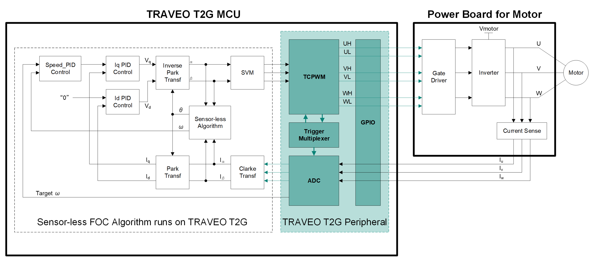
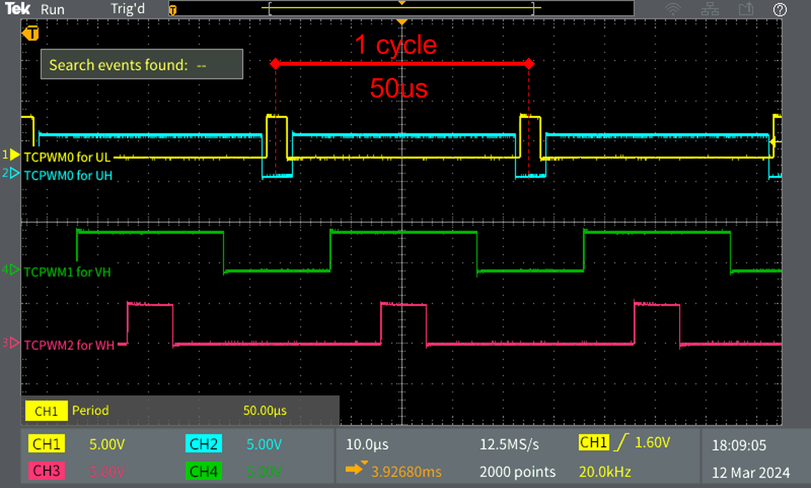
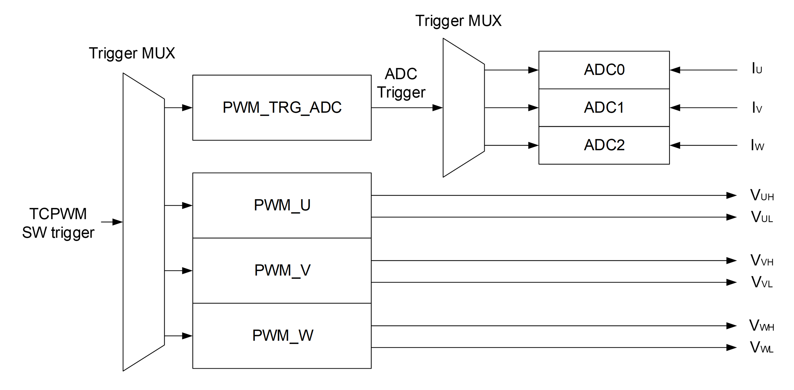
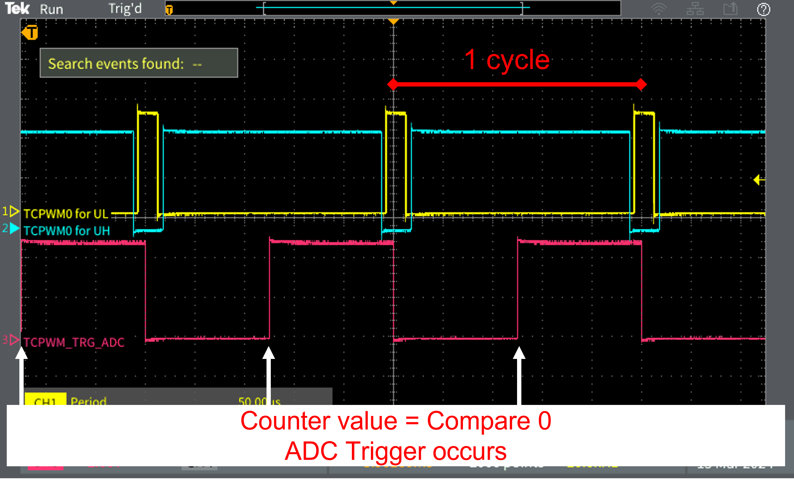
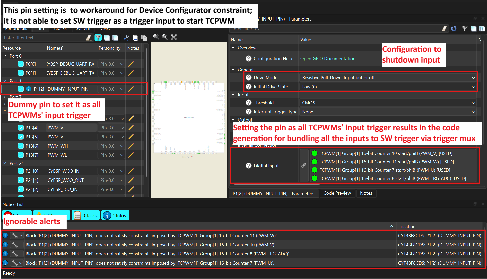
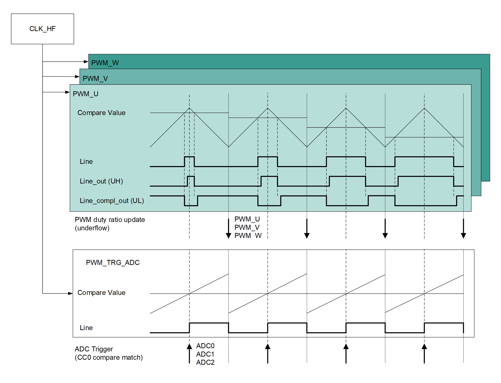
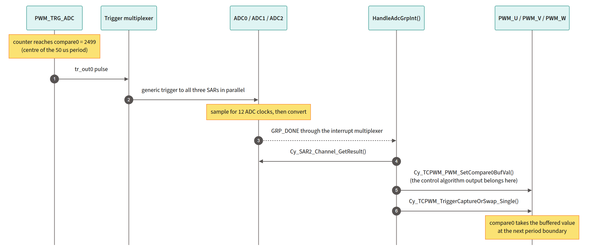
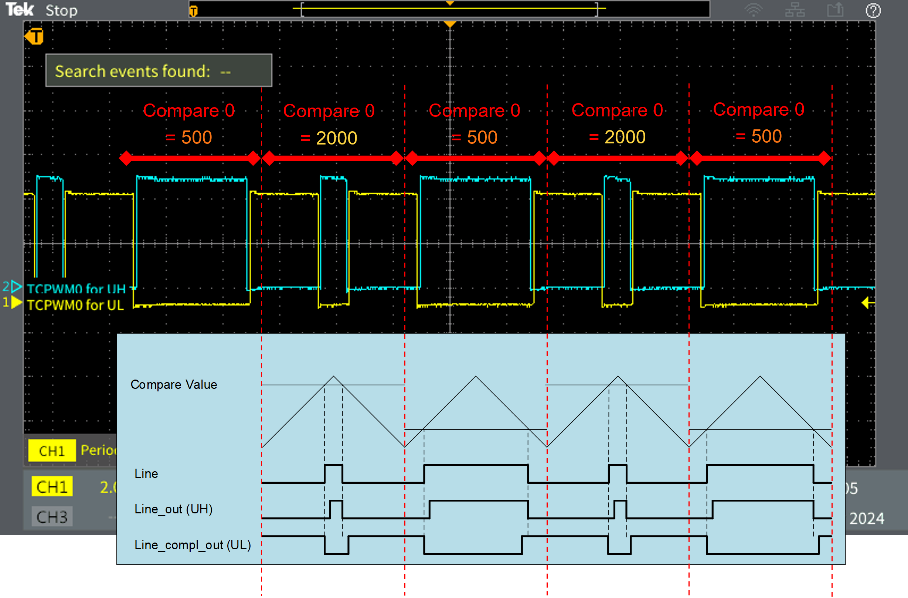
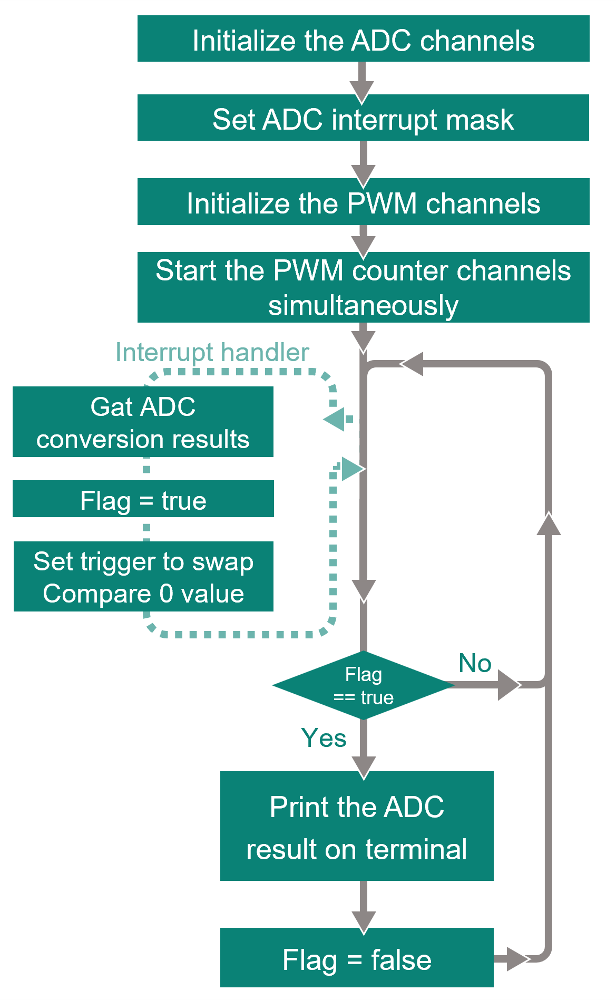
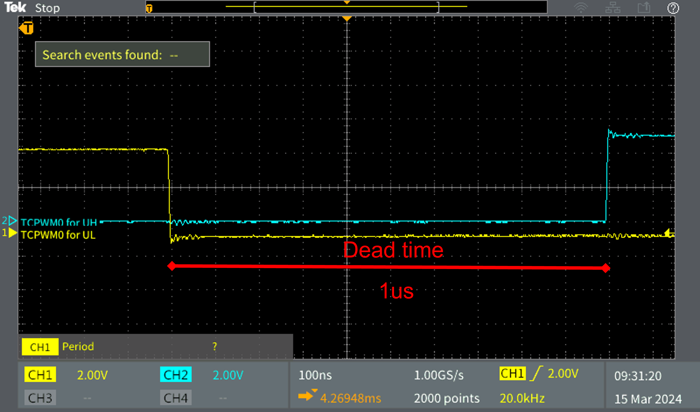

# TRAVEO&trade; T2G: Three-phase PWM and synchronized three-channel ADC

This code example generates three complementary PWM signal pairs with dead time (U, V, and W phases of a three-phase inverter) and samples three SAR ADC channels simultaneously at a fixed instant inside every PWM period. The sampling trigger is produced by a dedicated TCPWM counter and distributed to all three ADCs through the peripheral trigger multiplexer, so the sampling instant is generated entirely in hardware with no CPU involvement.

This example is a peripheral-level reference. It shows which TRAVEO&trade; T2G resources to use for a motor control front end, how to connect them in the device configurator, and which peripheral driver library (PDL) functions to call. It does **not** implement a field-oriented control (FOC) algorithm.


   **Figure 1. Peripheral block in motor system implemented in this code example**

   


[View this README on GitHub.](https://github.com/Infineon/mtb-example-ce243494-three-phase-pwm-sync-adc)

[Provide feedback on this code example.](https://yourvoice.infineon.com/jfe/form/SV_1NTns53sK2yiljn?Q_EED=eyJVbmlxdWUgRG9jIElkIjoiQ0UyNDM0OTQiLCJTcGVjIE51bWJlciI6IjAwMi00MzQ5NCIsIkRvYyBUaXRsZSI6IlRSQVZFTyZ0cmFkZTsgVDJHOiBUaHJlZS1waGFzZSBQV00gYW5kIHN5bmNocm9uaXplZCB0aHJlZS1jaGFubmVsIEFEQyIsInJpZCI6InNvcmEuc2F0b0BpbmZpbmVvbi5jb20iLCJEb2MgdmVyc2lvbiI6IjEuMC4wIiwiRG9jIExhbmd1YWdlIjoiRW5nbGlzaCIsIkRvYyBEaXZpc2lvbiI6Ik1DRCIsIkRvYyBCVSI6IkFVVE8iLCJEb2MgRmFtaWx5IjoiQVVUTyBNQ1UifQ==)

## Requirements

- [ModusToolbox&trade;](https://www.infineon.com/modustoolbox) v3.8 or later (tested with v3.8)
- Board support package (BSP) minimum required version: 3.0.0
- Programming language: C
- Associated parts: [TRAVEO&trade; T2G family body high CYT4BF series](https://www.infineon.com/products/microcontroller/32-bit-traveo-t2g-arm-cortex/for-body/t2g-cyt4bf)


## Supported toolchains (make variable 'TOOLCHAIN')

- GNU Arm&reg; Embedded Compiler v14.2.1 (`GCC_ARM`) – Default value of `TOOLCHAIN`
- Arm&reg; Compiler v6.22 (`ARM`)
- IAR C/C++ Compiler v9.70.4 (`IAR`)


## Supported kits (make variable 'TARGET')

- [TRAVEO&trade; T2G Body High Lite Kit](https://www.infineon.com/evaluation-board/KIT-T2G-B-H-LITE) (`KIT_T2G-B-H_LITE`) – Default value of `TARGET`


## Hardware setup

This example uses the board's default configuration. See the kit user guide to ensure that the board is configured correctly.
<br>


> **Note:** Do not connect this example to an inverter power stage unless an FOC algorithm is manually implemented by the user. The duty ratios are static in the original code and no fault or over-current protection is implemented.


## Software setup

See the [ModusToolbox&trade; tools package installation guide](https://www.infineon.com/ModusToolboxInstallguide) for information about installing and configuring the tools package.
Install a terminal emulator if you do not have one. 
Instructions in this document use [Tera Term](https://teratermproject.github.io/index-en.html).


## Using the code example

### Create the project

The ModusToolbox&trade; tools package provides the Project Creator as both a GUI tool and a command line tool.

<details><summary><b>Use Project Creator GUI</b></summary>

1. Open the Project Creator GUI tool

   There are several ways to do this, including launching it from the dashboard or from inside the Eclipse IDE. For more details, see the [Project Creator user guide](https://www.infineon.com/ModusToolboxProjectCreator) (locally available at *{ModusToolbox&trade; install directory}/tools_{version}/project-creator/docs/project-creator.pdf*)

2. On the **Choose Board Support Package (BSP)** page, select a kit supported by this code example. See [Supported kits](#supported-kits-make-variable-target)

   > **Note:** To use this code example for a kit not listed here, you may need to update the source files. If the kit does not have the required resources, the application may not work

3. On the **Select Application** page:

   a. Select the **Applications(s) Root Path** and the **Target IDE**

      > **Note:** Depending on how you open the Project Creator tool, these fields may be pre-selected for you

   b. Select this code example from the list by enabling its check box

      > **Note:** You can narrow the list of displayed examples by typing in the filter box

   c. (Optional) Change the suggested **New Application Name** and **New BSP Name**

   d. Click **Create** to complete the application creation process

</details>

<details><summary><b>Use Project Creator CLI</b></summary>

The 'project-creator-cli' tool can be used to create applications from a CLI terminal or from within batch files or shell scripts. This tool is available in the *{ModusToolbox&trade; install directory}/tools_{version}/project-creator/* directory.

Use a CLI terminal to invoke the 'project-creator-cli' tool. On Windows, use the command-line 'modus-shell' program provided in the ModusToolbox&trade; installation instead of a standard Windows command-line application. This shell provides access to all ModusToolbox&trade; tools. You can access it by typing "modus-shell" in the search box in the Windows menu. In Linux and macOS, you can use any terminal application.


The following example clones the "[mtb-example-ce243494-three-phase-pwm-sync-adc](https://github.com/Infineon/mtb-example-ce243494-three-phase-pwm-sync-adc)" application with the desired name "ThreePhasePwmAdc" configured for the *KIT_T2G-B-H_LITE* BSP into the specified working directory, *C:/mtb_projects*:

   ```
   project-creator-cli --board-id KIT_T2G-B-H_LITE --app-id mtb-example-ce243494-three-phase-pwm-sync-adc --user-app-name ThreePhasePwmAdc --target-dir "C:/mtb_projects"
   ```


The 'project-creator-cli' tool has the following arguments:

Argument | Description | Required/optional
---------|-------------|-----------
`--board-id` | Defined in the <id> field of the [BSP](https://github.com/Infineon?q=bsp-manifest&type=&language=&sort=) manifest | Required
`--app-id`   | Defined in the <id> field of the [CE](https://github.com/Infineon?q=ce-manifest&type=&language=&sort=) manifest | Required
`--target-dir`| Specify the directory in which the application is to be created if you prefer not to use the default current working directory | Optional
`--user-app-name`| Specify the name of the application if you prefer to have a name other than the example's default name | Optional

<br>

> **Note:** The project-creator-cli tool uses the `git clone` and `make getlibs` commands to fetch the repository and import the required libraries. For details, see the "Project creator tools" section of the [ModusToolbox&trade; tools package user guide](https://www.infineon.com/ModusToolboxUserGuide) (locally available at {ModusToolbox&trade; install directory}/docs_{version}/mtb_user_guide.pdf).

</details>


### Open the project

After the project has been created, you can open it in your preferred development environment.


<details><summary><b>Eclipse IDE</b></summary>

If you opened the Project Creator tool from the included Eclipse IDE, the project will open in Eclipse automatically.

For more details, see the [Eclipse IDE for ModusToolbox&trade; user guide](https://www.infineon.com/MTBEclipseIDEUserGuide) (locally available at *{ModusToolbox&trade; install directory}/docs_{version}/mt_ide_user_guide.pdf*).

</details>


<details><summary><b>Visual Studio (VS) Code</b></summary>

Launch VS Code manually, and then open the generated *{project-name}.code-workspace* file located in the project directory.

For more details, see the [Visual Studio Code for ModusToolbox&trade; user guide](https://www.infineon.com/MTBVSCodeUserGuide) (locally available at *{ModusToolbox&trade; install directory}/docs_{version}/mt_vscode_user_guide.pdf*).

</details>


<details><summary><b>Arm&reg; Keil&reg; µVision&reg;</b></summary>

Double-click the generated *{project-name}.cprj* file to launch the Keil&reg; µVision&reg; IDE.

For more details, see the [Arm&reg; Keil&reg; µVision&reg; for ModusToolbox&trade; user guide](https://www.infineon.com/MTBuVisionUserGuide) (locally available at *{ModusToolbox&trade; install directory}/docs_{version}/mt_uvision_user_guide.pdf*).

</details>


<details><summary><b>IAR Embedded Workbench</b></summary>

Open IAR Embedded Workbench manually, and create a new project. Then select the generated *{project-name}.ipcf* file located in the project directory.

For more details, see the [IAR Embedded Workbench for ModusToolbox&trade; user guide](https://www.infineon.com/MTBIARUserGuide) (locally available at *{ModusToolbox&trade; install directory}/docs_{version}/mt_iar_user_guide.pdf*).

</details>


<details><summary><b>Command line</b></summary>

If you prefer to use the CLI, open the appropriate terminal, and navigate to the project directory. On Windows, use the command-line 'modus-shell' program; on Linux and macOS, you can use any terminal application. From there, you can run various `make` commands.

For more details, see the [ModusToolbox&trade; tools package user guide](https://www.infineon.com/ModusToolboxUserGuide) (locally available at *{ModusToolbox&trade; install directory}/docs_{version}/mtb_user_guide.pdf*).

</details>


## Operation


1. Connect the board to your PC using the provided USB cable through the KitProg3 USB connector

2. Open a terminal program and select the KitProg3 COM port. Set the serial port parameters to 8N1 and 115200 baud

3. Program the board using one of the following:

   <details><summary><b>Using Eclipse IDE</b></summary>

      a. Select the application project in the Project Explorer

      b. In the **Quick Panel**, scroll down, and click **\<Application Name> Program (KitProg3_MiniProg4)**
   </details>


   <details><summary><b>In other IDEs</b></summary>

   Follow the instructions in your preferred IDE.
   </details>


   <details><summary><b>Using CLI</b></summary>

     From the terminal, execute the `make program` command to build and program the application using the default toolchain to the default target. The default toolchain is specified in the application's Makefile but you can override this value manually:
      ```
      make program TOOLCHAIN=<toolchain>
      ```

      Example:
      ```
      make program TOOLCHAIN=GCC_ARM
      ```

    </details>

4. After programming, the application starts automatically. Confirm that the banner and the initialization messages are displayed on the UART terminal, followed by a single ADC raw result line that refreshes continuously

    ```
    ********************************************************************************
     PDL: Three-phase PWM and synchronized three-channel ADC sampling
    ********************************************************************************
    TCPWM counter and PWM are configured...
    PWM trigger started successfully...

     ADC results:   SAR0/CH0-2048   SAR1/CH0-1024   SAR2/CH0-   0
    ```

<br>

5. (Optional) Apply a DC voltage between 0 V and VDDA to the three analog input pins and confirm that the corresponding `SAR0`, `SAR1`, and `SAR2` values change. The values are right-aligned unsigned 12-bit results, so the range is 0 to 4095

6. (Optional) Probe the PWM outputs with an oscilloscope and confirm the following

   **Table 1. Expected waveforms**

    Probe | Expected result
    :---- | :--------------
    `PWM_U` output pair    | Complementary pair, 20 kHz, approximately 20 % duty on the high side
    `PWM_V` output pair    | Complementary pair, 20 kHz, approximately 60 % duty on the high side
    `PWM_W` output pair    | Complementary pair, 20 kHz, approximately 80 % duty on the high side
    Any complementary pair | 1 µs dead time between the falling edge of one output and the rising edge of the other
    `PWM_TRG_ADC` output   | 20 kHz signal whose edge marks the ADC sampling instant, aligned with the centre of the PWM period
    <br>

   All three phases rise and fall around the same centre point, which confirms that the four counters were started by a single trigger.

   See [Resources and settings](#resources-and-settings) for the pin that each of these signals is assigned to on your kit.

   **Figure 2. Three-phase PWM waveforms**

   


## Debugging

You can debug the example to step through the code.

> **Note:** Halting the CPU does not stop the TCPWM counters or the ADC trigger chain. The PWM outputs keep switching and the ADCs keep converting while the debugger is halted, but `HandleAdcGrpInt()` no longer runs, so the results printed after resuming may be stale for one cycle.


<details><summary><b>In Eclipse IDE</b></summary>

Use the **\<Application Name> Debug (KitProg3_MiniProg4)** configuration in the **Quick Panel**. For details, see the "Program and debug" section in the [Eclipse IDE for ModusToolbox&trade; user guide](https://www.infineon.com/MTBEclipseIDEUserGuide).

> **Note:** **(Only while debugging)** On the application CPU core, some code in `main()` may execute before the debugger halts at the beginning of `main()`. This means that some code executes twice – once before the debugger stops execution, and again after the debugger resets the program counter to the beginning of `main()`. See [KBA231071](https://community.infineon.com/docs/DOC-21143) to learn about this and for the workaround.


</details>


<details><summary><b>In other IDEs</b></summary>

Follow the instructions in your preferred IDE.
</details>


## Design and implementation

### Hardware trigger topology

A three-phase motor control loop needs two things from the peripherals: three complementary PWM pairs to drive the inverter legs, and a set of feedback samples captured at exactly the same instant in every PWM period. This example builds both, and builds the path between them entirely in hardware.

The sampling instant matters because a phase current is only meaningful while a known switch combination is applied. If that instant were produced by software, task latency and interrupt jitter would move it around and corrupt the feedback. Here a dedicated TCPWM counter produces the trigger and the peripheral trigger multiplexer delivers it to all three SAR ADCs, so the instant is deterministic and identical for the three channels.

   **Figure 3. I/O flow in TRAVEO&trade; T2G peripheral block**

   


Two independent trigger paths are used:

- **Start path** – built once at startup. A single software trigger starts all four counters on the same clock edge, so the three phases and the ADC trigger counter stay phase-locked from then on
- **Sampling path** – free-running. `PWM_TRG_ADC` emits a trigger on every compare match and the trigger multiplexer fans it out to the three SAR ADCs


   **Figure 4. ADC trigger timing**

   


Which multiplexer group, which trigger line, and which peripheral instance implement each box above depends on the device. See [Resources and settings](#resources-and-settings) for the assignment used on the supported kit.

### Starting all four counters at the same instant

Each of the four counters selects the same all-counter trigger input (`tr_all_cnt_in[n]`) as its start source. This line is shared by every counter in a TCPWM group, so a single pulse on it reaches all four counters on the same clock edge. The Device Configurator allocates a free line and writes the encoded selector value into the generated configuration: the TCPWM start-input selector reserves value 0 and 1 for the two constants and the next `TR_ONE_CNT_NR` values for the per-counter trigger inputs, so `tr_all_cnt_in[n]` maps to `2 + TR_ONE_CNT_NR + n`. Both the index and the resulting selector value differ per device, which is why the application never hard-codes them.

`StartConversion()` pulses that line with a single call:

```c
Cy_TrigMux_SwTrigger(TCPWM_ALL_TRIG_INPUT, CY_TRIGGER_TWO_CYCLES);
```

`TCPWM_ALL_TRIG_INPUT` is defined in [main.c](main.c) as the Device Configurator-generated `PWM_U_start_0_TRIGGER_OUT` macro. Passing an *output* line of the trigger multiplexer is deliberate: `Cy_TrigMux_SwTrigger()` sets the `OUT_SEL` bit in `PERI_TR_CMD` and drives the multiplexer output directly, bypassing its input selection. This is what makes a single call reach all four counters. `CY_TRIGGER_TWO_CYCLES` is the only pulse width supported by this peripheral version and it also satisfies the minimum trigger input pulse width of the TCPWM.

Because all four counters share the same start line, any of `PWM_U_start_0_TRIGGER_OUT`, `PWM_V_start_0_TRIGGER_OUT`, `PWM_W_start_0_TRIGGER_OUT`, or `PWM_TRG_ADC_start_0_TRIGGER_OUT` can be used – they all expand to the same value. Always go through the generated macro rather than a literal trigger name: the value depends on the device and on the routing the Device Configurator chooses, so a hard-coded name breaks as soon as the example is rebuilt for another kit.

> **Note:** The Device Configurator requires every net to have a driver, so `DUMMY_INPUT_PIN` appears as the nominal source of the start net. It is configured with a drive mode that disables the pin input buffer (`..._IN_OFF`), so the pin cannot inject a trigger and does not need to be connected to anything. The only real source of the start trigger is the software call above. Do not change this pin to a drive mode with the input buffer enabled.


  **Figure 5. Pin configuration for workaround of Device Configurator constraint**
  


### Sampling instant

`PWM_TRG_ADC` is a right-aligned PWM counter with `period0 = 4999` and `compare0 = 2499`, and its `trigger0Event` is set to `CY_TCPWM_CNT_TRIGGER_ON_CC0_MATCH`. It therefore emits one trigger halfway through each 50 µs window – the centre of the PWM period, where the switching transients of the centre-aligned phase outputs have settled.

All three SAR ADC channels select `CY_SAR2_TRIGGER_GENERIC0` and are marked as group end (`isGroupEnd = true`), so each conversion produces a `GRP_DONE` interrupt. Because the three ADCs are separate SAR instances driven from one trigger, the three channels sample at the same instant rather than sequentially through a multiplexer.

The counter output is also routed to a pin so that the sampling instant can be observed on an oscilloscope alongside the phase outputs.


  **Figure 6. Trigger timing chart**
  


   **Figure 7. One control cycle**

   


### Updating the duty ratio without glitches

Writing a new compare value directly into a running counter can produce a truncated or stretched pulse if the write lands after the counter has already passed the new value. The three phase counters therefore enable the compare buffer (`enableCompareSwap = true`), which turns the update into a two-step operation:

1. `Cy_TCPWM_PWM_SetCompare0BufVal()` stores the new value in a shadow register
2. `Cy_TCPWM_TriggerCaptureOrSwap_Single()` arms the swap, and the hardware copies the shadow register into `compare0` at the next period boundary

Issuing the swap for all three phases in the same interrupt makes the new duty ratios take effect together, which is what a three-phase modulator requires.

`UpdateDutyRatio()` in [main.c](main.c) performs step 2 for all three phases and contains a commented-out step 1. **This is the hook point for a control algorithm:** a FOC implementation would compute the three compare values from the ADC results and write them there.


**Figure 8. Compare swap timing**



### Interrupt design

`ADC0`, `ADC1`, and `ADC2` raise three separate SAR interrupt sources. TRAVEO&trade; T2G routes peripheral interrupts to the CPU through an interrupt multiplexer, so all three sources are mapped to the same multiplexer channel and share a single handler:

```c
Cy_SysInt_Init(&IRQ_CFG_ADC0, &HandleAdcGrpInt);
Cy_SysInt_Init(&IRQ_CFG_ADC1, &HandleAdcGrpInt);
Cy_SysInt_Init(&IRQ_CFG_ADC2, &HandleAdcGrpInt);
```

`HandleAdcGrpInt()` reads the masked interrupt status of each SAR to find out which one fired, collects the result, clears the flag, and then arms the compare swap.

The `main()` loop only prints. All time-critical work happens in the interrupt, and the printing rate is limited by the UART, not by the control loop.

### Application flow


**Figure 9. Software flow chart**



The ADCs are initialized before the PWM counters so that the sampling path is ready before the first trigger can arrive. Nothing runs until `StartConversion()` releases the start trigger.

### Resources and settings

**Table 2. Application resources**

 Resource      |  Alias/object     |    Purpose
 :-------      | :------------     | :------------
 TCPWM (PWM)   | `PWM_U`           | Phase-U complementary PWM pair with dead time
 TCPWM (PWM)   | `PWM_V`           | Phase-V complementary PWM pair with dead time
 TCPWM (PWM)   | `PWM_W`           | Phase-W complementary PWM pair with dead time
 TCPWM (PWM)   | `PWM_TRG_ADC`     | Generates the ADC sampling trigger; also driven out on a pin so the sampling instant can be monitored
 SAR ADC       | `ADC0`            | Phase-U feedback input
 SAR ADC       | `ADC1`            | Phase-V feedback input
 SAR ADC       | `ADC2`            | Phase-W feedback input
 SCB (UART)    | `UART`            | Debug UART used by `retarget-io` for `printf()`
 GPIO          | `DUMMY_INPUT_PIN` | Nominal driver of the start-trigger net; input buffer disabled, leave unconnected
<br>

These aliases are the only peripheral names that appear in [main.c](main.c). Everything device- and board-specific behind them – which TCPWM counter, which SAR instance, which trigger multiplexer line, which interrupt channel, and which pin – is resolved by the Device Configurator and reaches the application through the generated `cycfg_*` headers. Porting this example to another kit therefore means re-creating the same connections in the Device Configurator for that BSP, not editing the source.

**Table 3. Device and pin assignment on `KIT_T2G-B-H_LITE` (CYT4BF8CDS)**

 Alias / function  | Peripheral instance | Pins
 :---------------- | :------------------ | :---
 `PWM_U`           | TCPWM1 counter 263   | P7.6 (high side) / P7.7 (low side)
 `PWM_V`           | TCPWM1 counter 266   | P13.4 (high side) / P13.5 (low side)
 `PWM_W`           | TCPWM1 counter 267   | P13.6 (high side) / P13.7 (low side)
 `PWM_TRG_ADC`     | TCPWM1 counter 264   | P13.0 (trigger monitor output)
 `ADC0`            | PASS0_SAR0 channel 0 | P11.0
 `ADC1`            | PASS0_SAR1 channel 0 | P11.1
 `ADC2`            | PASS0_SAR2 channel 0 | P11.2
 `UART`            | SCB0                 | P0.0 (RX) / P0.1 (TX), wired to the on-board KitProg3 USB-UART bridge
 `DUMMY_INPUT_PIN` | –                    | P1.2, leave unconnected
 Start trigger line | Trigger multiplexer group 6, `tr_all_cnt_in[21]` (selector value `0x1A`) | –
 ADC trigger lines  | Trigger multiplexer group 7, `PASS_GEN_TR_IN0` / `IN4` / `IN8` | –
 ADC interrupt      | `NvicMux2_IRQn`, priority 0 | –
<br>

> **Note:** Table 3 applies to `KIT_T2G-B-H_LITE` only. On a different kit the counter numbers, SAR instances, trigger multiplexer indices, interrupt channel, and pins will all differ. Open the Device Configurator on the target BSP, assign the same aliases, and rebuild; no source change is required.

**Table 4. Clocks and timing**

 Item | Value | Derivation
 :--- | :---- | :---------
 Peripheral clock group root (CLK_HF2) | 100 MHz | System configuration
 `TCPWM_CLK`   | 100 MHz  | 8-bit divider, ÷1
 `ADC_CLK`     | 12.5 MHz | 8-bit divider, ÷8
 `DEBUG_UART_CLK` | 917 kHz | 8-bit divider, ÷109; with 8x oversampling this gives 115200 baud
 PWM frequency | 20 kHz   | 100 MHz / (2 × 2500), centre-aligned
 PWM period    | 50 µs    | 1 / 20 kHz
 Dead time     | 1 µs     | 100 TCPWM clocks / 100 MHz
 ADC trigger period | 50 µs | 100 MHz / 5000, right-aligned
 Sampling instant   | 25 µs into each period | `compare0 = 2499` of 0…4999
 ADC sample time    | 0.96 µs | 12 ADC clocks / 12.5 MHz, plus the SAR conversion phase
 Duty ratio of `PWM_U` / `PWM_V` / `PWM_W` | 20 % / 60 % / 80 % | (`period0` − `compare0`) / `period0` for centre-aligned PWM
<br>

The counts in Table 4 follow from the peripheral clock frequency above. On a device with a different peripheral clock, recalculate the period, compare, and dead-time counts to keep the same 20 kHz switching frequency and 1 µs dead time.


   **Figure 10. Dead time between complementary PWM signals**

   


The three phases use different fixed compare values so that the outputs are easy to tell apart on an oscilloscope. They do not represent a modulation pattern.

**Table 5. Key Device Configurator settings**

 Block | Setting | Value
 :---- | :------ | :----
 `PWM_U` / `PWM_V` / `PWM_W` | PWM mode | Dead time
 `PWM_U` / `PWM_V` / `PWM_W` | Alignment | Centre aligned
 `PWM_U` / `PWM_V` / `PWM_W` | Period / dead time | 2500 / 100 clocks
 `PWM_U` / `PWM_V` / `PWM_W` | Compare 0 | 2000 / 1000 / 500
 `PWM_U` / `PWM_V` / `PWM_W` | Swap compare | Enabled
 `PWM_TRG_ADC` | PWM mode / alignment | PWM / right aligned
 `PWM_TRG_ADC` | Period / compare 0 | 4999 / 2499
 `PWM_TRG_ADC` | Trigger 0 event | On CC0 match
 All four counters | Start input / edge | A shared all-counter trigger line / rising edge
 `ADC0` / `ADC1` / `ADC2` channel 0 | Trigger selection | Generic 0
 `ADC0` / `ADC1` / `ADC2` channel 0 | Group end / done level | Enabled / pulse
 `ADC0` / `ADC1` / `ADC2` channel 0 | Sample time / average count | 12 / 1
 `ADC0` / `ADC1` / `ADC2` channel 0 | Result alignment / sign | Right / unsigned
<br>

To inspect or change any of these, open the Device Configurator from the ModusToolbox&trade; Quick Panel or run `make config`. Do not edit the files under *GeneratedSource*.

### Out of scope

This example intentionally stops at the peripheral layer. The following are **not** implemented and must be added before the code can drive real hardware:

- The FOC algorithm itself – Clarke and Park transforms, current and speed regulators, and space-vector modulation. `UpdateDutyRatio()` marks where the results would be applied
- Current-sense signal conditioning, offset calibration, and the mapping from ADC counts to amperes
- Rotor position or speed feedback from a resolver, encoder, or sensorless observer
- Protection – over-current detection, the TCPWM kill input, fault handling, and a safe shutdown path
- Any gate driver, power stage, or motor connection

For a complete motor control solution, the [motor-ctrl-lib](https://github.com/Infineon/motor-ctrl-lib) middleware and the code example [Motor control demo](https://github.com/Infineon/mtb-example-ce240614-motor-control-solutions) are available.

## Related resources

Resources  | Links
-----------|----------------------------------
Application notes  | [AN235305](https://www.infineon.com/assets/row/public/documents/10/42/infineon-an235305-getting-started-with-traveo-t2g-family-mcus-in-modustoolbox-applicationnotes-en.pdf) – Getting started with TRAVEO&trade; T2G family MCUs in ModusToolbox&trade; <br> [AN220224](https://www.infineon.com/gated/infineon-an220224---how-to-use-timer-counter-and-pwm-tcpwm-in-traveo-t2g-family-applicationnotes-en_d6cf39c3-1404-4af3-84fd-d3cac057dbeb) – How to use Timer, Counter, and PWM (TCPWM) in TRAVEO&trade; T2G family <br> [AN219755](https://www.infineon.com/gated/infineon-an219755---using-a-sar-adc-in-traveo-t2g-automotive-microcontrollers-applicationnotes-en_82d8de8b-fd22-4e61-adae-020a2f2b0624) – Using a SAR ADC in TRAVEO&trade; T2G automotive microcontrollers <br> [AN228104](https://www.infineon.com/gated/infineon-an228104-how-to-use-trigger-multiplexer-in-traveo-t2g-family_91b562be-0d84-4b7f-a084-24ef4887a25b) – How to use trigger multiplexer in TRAVEO&trade; T2G family
Code examples  | [Using ModusToolbox&trade;](https://github.com/Infineon/Code-Examples-for-ModusToolbox-Software) on GitHub
Device documentation | [TRAVEO&trade; T2G body high family MCUs datasheets](https://www.infineon.com/products/microcontroller/32-bit-traveo-t2g-arm-cortex/for-body/t2g-cyt4bf/#documents) <br> [TRAVEO&trade; T2G body high family MCUs architecture/registers reference manuals](https://www.infineon.com/products/microcontroller/32-bit-traveo-t2g-arm-cortex/for-body/t2g-cyt4bf/#documents)
Development kits | Select your kits from the [Evaluation board finder](https://www.infineon.com/cms/en/design-support/finder-selection-tools/product-finder/evaluation-board).
Libraries on GitHub  | [mtb-pdl-cat1](https://github.com/Infineon/mtb-pdl-cat1) – Peripheral Driver Library (PDL) <br> [retarget-io](https://github.com/Infineon/retarget-io) – Utility library to retarget STDIO messages to a UART port
 <br> Tools  | [ModusToolbox&trade;](https://www.infineon.com/modustoolbox) – ModusToolbox&trade; software is a collection of easy-to-use libraries and tools enabling rapid development with Infineon MCUs for applications ranging from wireless and cloud-connected systems, edge AI/ML, embedded sense and control, to wired USB connectivity using PSOC&trade; Industrial/IoT MCUs, AIROC&trade; Wi-Fi and Bluetooth&reg; connectivity devices, XMC&trade; Industrial MCUs, and EZ-USB&trade;/EZ-PD&trade; wired connectivity controllers. ModusToolbox&trade; incorporates a comprehensive set of BSPs, libraries, configuration tools, and provides support for industry-standard IDEs to fast-track your embedded application development.
<br>

## Other resources


Infineon provides a wealth of data at [www.infineon.com](https://www.infineon.com) to help you select the right device, and quickly and effectively integrate it into your design.


## Document history

Document title: *CE243494 – TRAVEO&trade; T2G: Three-phase PWM and synchronized three-channel ADC*

 Version | Description of change
 ------- | ---------------------
 1.0.0   | New code example

<br>


All referenced product or service names and trademarks are the property of their respective owners.

The Bluetooth&reg; word mark and logos are registered trademarks owned by Bluetooth SIG, Inc., and any use of such marks by Infineon is under license.

PSOC&trade;, formerly known as PSoC&trade;, is a trademark of Infineon Technologies. Any references to PSoC&trade; in this document or others shall be deemed to refer to PSOC&trade;.

---------------------------------------------------------
(c) 2026, Infineon Technologies AG, or an affiliate of Infineon Technologies AG. All rights reserved.
This software, associated documentation and materials ("Software") is owned by Infineon Technologies AG or one of its affiliates ("Infineon") and is protected by and subject to worldwide patent protection, worldwide copyright laws, and international treaty provisions. Therefore, you may use this Software only as provided in the license agreement accompanying the software package from which you obtained this Software. If no license agreement applies, then any use, reproduction, modification, translation, or compilation of this Software is prohibited without the express written permission of Infineon.
<br>
Disclaimer: UNLESS OTHERWISE EXPRESSLY AGREED WITH INFINEON, THIS SOFTWARE IS PROVIDED AS-IS, WITH NO WARRANTY OF ANY KIND, EXPRESS OR IMPLIED, INCLUDING, BUT NOT LIMITED TO, ALL WARRANTIES OF NON-INFRINGEMENT OF THIRD-PARTY RIGHTS AND IMPLIED WARRANTIES SUCH AS WARRANTIES OF FITNESS FOR A SPECIFIC USE/PURPOSE OR MERCHANTABILITY. Infineon reserves the right to make changes to the Software without notice. You are responsible for properly designing, programming, and testing the functionality and safety of your intended application of the Software, as well as complying with any legal requirements related to its use. Infineon does not guarantee that the Software will be free from intrusion, data theft or loss, or other breaches (“Security Breaches”), and Infineon shall have no liability arising out of any Security Breaches. Unless otherwise explicitly approved by Infineon, the Software may not be used in any application where a failure of the Product or any consequences of the use thereof can reasonably be expected to result in personal injury.
